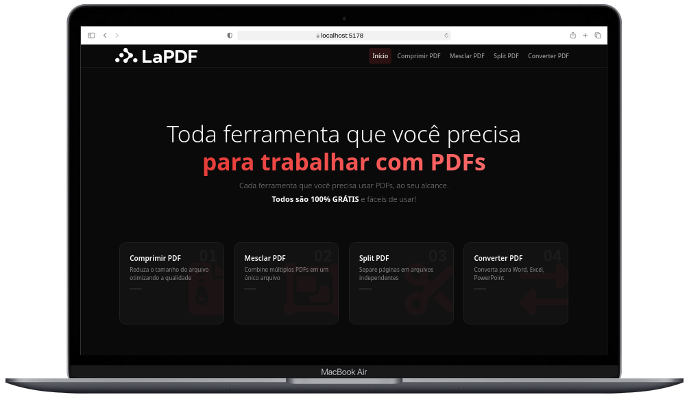

<div align="center">
   
  </br> </br>
  
  [](https://github.com/Adyllsxn/la-pasta)
  [](https://adyllsxn.github.io/la-pasta/)
  [](LICENSE)

</div>

---

## 📖 SOBRE O PROJETO

> **La Pasta** é uma landing page desenvolvida para um restaurante especializado em massas artesanais. O projeto foi construído com Blazor WebAssembly, uma SPA (Single Page Application) que proporciona uma experiência fluida e interativa para os usuários.

### ✨ Funcionalidades:
```markdown
✅ Design totalmente responsivo (Desktop, Tablet e Smartphone)
✅ Cardápio interativo com categorias (Massas, Molhos, Acompanhamentos)
✅ Navegação por componentes (SPA - sem recarregar a página)
✅ Sistema de reserva de mesa (formulário com validação)
✅ Galeria de pratos com efeitos visuais
✅ Depoimentos de clientes
✅ Promoções e ofertas especiais
✅ Formulário de contato
✅ Botão "Voltar ao topo"
✅ Animações suaves com CSS e interatividade com C#/Blazor
✅ PWA (Progressive Web App) - pode ser instalado como app
✅ Componentes reutilizáveis com Razor
```

---

## 🛠️ TECNOLOGIAS

| Layer | Technologies |
|-------|-------------|
| **Frontend** | Blazor WebAssembly, .NET 10 |
| **Estilização** | CSS Custom Properties, Responsive Design |
| **PWA** | Service Worker, Manifest.json |
| **Fontes** | Google Fonts (Playfair Display, Lora) |
| **Build** | .NET SDK |
| **Deploy** | Github Pages |

---


## 📸 DEMO
<div align="center">  <br /> <i>Interface principal</i> </div>

---

## **PRÉ-REQUISITOS**

Antes de começar, certifique-se de ter atendido aos seguintes requisitos:

* [Git](https://git-scm.com/downloads) deve estar instalado no seu sistema operacional.
* [.NET SDK 10.0+](https://dotnet.microsoft.com/download) deve estar instalado.

### Executar Localmente

Para executar o **LAPasta** localmente, execute este comando no seu git bash:

```bash
# Clone o repositório
git clone https://github.com/Adyllsxn/la-pasta.git

# Entre na pasta
cd la-pasta/website

# Rode o projeto
dotnet run
```
> Local http://localhost:5224

> Remoto https://adyllsxn.github.io/la-pasta/

---

## 📌 CRÉDITOS

Inspirado no projeto [Grilli ](https://github.com/codewithsadee/grilli) de [codewithsadee](https://github.com/codewithsadee)

---

## 📄 LICENSE

> Este projeto está sob a licença **MIT**. Isso significa que você pode usar, copiar, modificar, mesclar, publicar, distribuir, sublicenciar e/ou vender cópias do software, desde que mantenha o aviso de copyright original.
